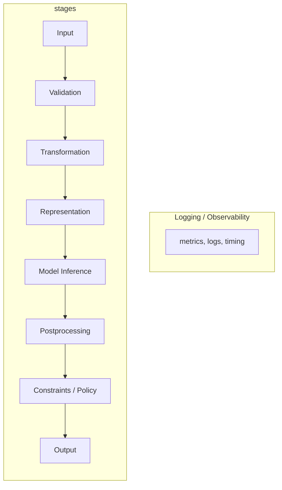

# Project Assignment 2: Pipeline Architecture, Contracts & Observability

## 1. Updated Architecture Diagram

The pipeline is mapped to the required stages with explicit boundaries. Cross-cutting **Logging / Observability** applies at every stage.



ASCII:

```
┌─────────────────────────────────────────────────────────────────────────────────────────────────────────┐
│  INPUT  →  VALIDATION  →  TRANSFORMATION  →  REPRESENTATION  →  MODEL INFERENCE  →  POSTPROCESSING  →   |
│                                                                                                         │
│  CONSTRAINTS / POLICY  →  OUTPUT  →  LOGGING / OBSERVABILITY (cross‑cutting)                            │
└─────────────────────────────────────────────────────────────────────────────────────────────────────────┘
```

### Stage mapping (audio → transcription → LLM)

| Stage | In this pipeline |
|-------|------------------|
| **Input** | Raw upload: `.mp3`, `.wav`, `.mp4` file (path or GCS URI). |
| **Validation** | Schema check: extension in `{mp3,wav,mp4}`, size ≤ 1 GB, file readable. |
| **Transformation** | Convert to WAV, normalize amplitude (pydub + FFmpeg). |
| **Representation** | Audio as WAV on disk; for LLM: transcript text → tokenization/chunking. |
| **Model Inference** | (1) Whisper ASR → text + chunks; (2) Hugging Face LLM → main topic, subtopics, truth statements. |
| **Postprocessing** | Merge segments by min words; parse/deduplicate LLM markdown tables; chunked merge for long transcripts. |
| **Constraints / Policy** | Max file size, max LLM input tokens, chunk size, allowed extensions. |
| **Output** | JSON: transcription, timestamps, main_topic, subtopics, truth_statements_md. |
| **Logging / Observability** | Step timing, segment counts, token counts, errors; optional metrics export. |

### Boundary annotations (what can fail and why)

- **Boundary A: Validation → Transformation**  
  **Can fail:** Invalid or corrupted file passes extension/size checks but FFmpeg/pydub fails to decode (e.g. wrong codec, truncated file, or sample-rate/channel mismatch). **Why:** Validation only checks schema (extension, size), not codec or internal consistency.

- **Boundary B: Representation → Model Inference**  
  **Can fail:** WAV sample rate or channel layout differs from what Whisper expects (e.g. 8 kHz vs 16 kHz), or transcript length exceeds LLM context and is silently truncated. **Why:** No explicit contract that representation shape/units match the model’s training assumptions.

- **Boundary C: Model Inference → Postprocessing**  
  **Can fail:** LLM returns malformed markdown (missing table, wrong columns, or non-UTF-8), so table parsing yields wrong or empty truth statements without raising. **Why:** Postprocessing assumes a fixed table format; no schema check on model output.

---

## 2. Data Contracts at Pipeline Boundaries

### Contract 1: Validation → Transformation (Upload → Preprocess)

| Field | Specification |
|-------|----------------|
| **Boundary** | Validation → Transformation (Preprocess) |
| **Input shape/type** | File path (Path or str); file exists; suffix in `{".mp3", ".wav", ".mp4"}`; size in bytes ∈ [1, 1_073_741_824]. |
| **Output shape/type** | Path to WAV file (Path); single channel (mono); PCM 16-bit. |
| **Units** | Sample rate: 16 kHz (Whisper expectation); duration in seconds. |
| **Allowed ranges** | Duration > 0 and ≤ 3 hours (configurable); sample rate 8k–48k (preprocess converts to 16k if needed). |
| **Missing data policy** | If file missing or unreadable → fail fast (FileNotFoundError / ValueError). No default or synthetic audio. |
| **Version** | `preprocess_v1` |
| **Example** | Input: `Path("uploads/abc123_meeting.mp3")`, 5.2 MB. Output: `Path("outputs/jobid_audio.wav")`, 16 kHz mono, 10 min. |

---

### Contract 2: Transformation → Representation (Preprocess → Transcribe)

| Field | Specification |
|-------|----------------|
| **Boundary** | Transformation (Preprocess) → Representation (Transcribe) |
| **Input shape/type** | WAV file path (Path); file exists; format WAV, mono, 16-bit PCM. |
| **Output shape/type** | `transcription: str` (UTF-8); `timestamps: list[dict]` with keys `start`, `end` (float seconds), `text` (str). |
| **Units** | Time in seconds; text in UTF-8 code points; no null bytes in text. |
| **Allowed ranges** | `start < end`; `start, end ≥ 0`; segment text length ≥ 0. |
| **Missing data policy** | If audio path missing or empty audio → raise; empty transcription → `""` and `[]` (no crash). |
| **Version** | `transcribe_v1` (Whisper model: `distil-whisper/distil-large-v3`) |
| **Example** | Input: `outputs/jobid_audio.wav`. Output: `transcription` = "Hello world."; `timestamps` = `[{"start": 0.0, "end": 0.5, "text": "Hello world."}]`. |

---

### Contract 3: Representation → Model Inference (Transcription → LLM)

| Field | Specification |
|-------|----------------|
| **Boundary** | Representation (transcript text) → Model Inference (LLM) |
| **Input shape/type** | UTF-8 string; length in characters ≤ 4 × `LLM_CHUNK_TRANSCRIPT_TOKENS` (chunked); or single string if under one chunk. |
| **Output shape/type** | Main topic: `str`; subtopics: `list[str]`; truth statements: markdown table string (UTF-8). |
| **Units** | Length in tokens (model tokenizer); no explicit unit for confidence beyond 1–5 in table. |
| **Allowed ranges** | Token count per chunk ≤ `LLM_MAX_INPUT_TOKENS`; no null tokens; table columns: Category, Truth Statement, Confidence Score (1–5), Context/Quote. |
| **Missing data policy** | Empty transcript → return "(No transcription)" and empty subtopics / "(No transcription.)" for truth table; do not call model. |
| **Version** | `llm_analyze_v1` (tokenizer/model: e.g. `Qwen/Qwen2.5-0.5B-Instruct`) |
| **Example** | Input: transcript string, 500 chars. Output: `main_topic` = "Project planning"; `subtopics` = ["Timeline", "Budget"]; `truth_statements_md` = "| Category | Truth Statement | ... |". |

---

## 3. Minimal Pipeline Implementation

The codebase implements a minimal working pipeline that:

- **Accepts input:** Upload (multipart or GCS enqueue) with `_validate_file(filename, size)`.
- **Validates schema:** Extension in `ALLOWED_EXTENSIONS`, size ≤ `MAX_FILE_SIZE_BYTES`; in-runner, `PipelineContext` and step order enforce that preprocess runs before transcribe, transcribe before analyze.
- **Transforms representation:** `preprocess()` converts to WAV and normalizes; transcribe produces text + timestamps; for LLM, transcript is optionally chunked by token count.
- **Calls a model:** Whisper ASR pipeline; Hugging Face LLM for topic and truth-statement extraction.
- **Postprocesses output:** `_merge_segments_by_min_words`, `_parse_truth_table_rows`, `_merge_dedup_truth_md`, `_merge_dedup_subtopics`.
- **Logs intermediate statistics:** Step-level progress and timing in runner; optional structured stats (segment count, token count, chunk count) in pipeline steps (see §5 and code in `app/pipeline/steps.py` and `app/pipeline/contracts.py`).

See: `app/main.py` (upload, validation), `app/pipeline/runner.py` (orchestration, step status), `app/pipeline/steps.py` (preprocess, transcribe, analyze_llm), and `app/pipeline/contracts.py` (boundary checks and stats).

---

## 4. Failure Injection and Analysis

Two intentional failures were injected and analyzed.

### Failure 1: Wrong file type

- **What changed:** Input an incorrect file type to the pipeline
- **Did the system crash?** No.
- **Did it silently fail?** Yes. No exception, just ignored and started the web server instead.
- **Which boundary allowed the failure?** Input → Successfully checked to validate the file type, but failed to notify user.
- **Architectural change to prevent it:** Add an output exception to let tell the user the file type was incorrect and that the file could not be processed.

### Failure 2: Silent truncation of input (LLM context)

- **What changed:** Transcript longer than `LLM_MAX_INPUT_TOKENS` was passed in a single call (truncation=True, max_length=LLM_MAX_INPUT_TOKENS), so the tail of the transcript was dropped without warning.
- **Did the system crash?** No.
- **Did it silently fail?** Yes. Truth statements and subtopics only repeated itselft over and over.
- **Which boundary allowed the failure?** Representation → Model Inference (truncation is implicit in tokenizer call; no explicit “input was truncated” flag or chunking requirement).
- **Architectural change to prevent it:** (Already partially in place.) Enforce chunked path when `len(transcript_tokens) > LLM_CHUNK_TRANSCRIPT_TOKENS`; never pass the full transcript in one call. Add a contract: “If transcript token count > chunk size, pipeline must use chunked extraction.” Log a metric when chunked path is used and emit a warning or flag if any chunk was truncated.

Implementation of both failure injections and assertions is in `tests/test_failure_injection.py`.

- **Run all failure-injection tests:**  
  `python -m unittest tests.test_failure_injection`  
  or `pytest tests/test_failure_injection.py -v`
- **Truncation test (no GPU):** runs by default; uses tokenizer only to show truncation drops tail.
- **Sample-rate test (slow, loads Whisper):** skipped unless `RUN_FAILURE_INJECTION_SLOW=1` is set.

---

## 5. Observability Plan

At least five items to monitor in production:

| # | What to monitor | Why it matters | Boundary it protects | Threshold of concern |
|---|------------------|----------------|----------------------|------------------------|
| 1 | **Input distribution (file size, format, count per hour)** | Detects abuse, format drift, and capacity planning. | Input → Validation | Sudden spike in size or count; new extension patterns. |
| 2 | **Preprocess output: WAV duration and sample rate** | Ensures transformation matches Whisper’s expected input (16 kHz). | Transformation → Representation | Sample rate ≠ 16 kHz; duration = 0 or > max allowed. |
| 3 | **Transcription segment count and total characters** | Detects empty or truncated ASR output and length extremes. | Representation → Model Inference | Segment count = 0 for non-silent audio; character count far from typical. |
| 4 | **LLM chunk count and token count per request** | Surfaces truncation and context overflow. | Representation → Model Inference | Token count ≥ max_length; chunk count > expected for transcript length. |
| 5 | **Per-step latency (p50, p90, p99)** | Identifies slow stages and regressions. | All boundaries | p99 preprocess or transcribe > 2× baseline; p99 analyze > 5× baseline. |
| 6 | **Error rate and retry rate by step** | Distinguishes validation vs model vs I/O failures. | Validation, Model Inference, Postprocessing | Error rate > 1%; retries on same job > 2. |

---

## 6. Latency and Throughput Considerations

- **Most expensive stage:** Model Inference (Whisper first load + transcribe; then LLM load + multiple generations for topic, subtopics, truth statements). For long audio, transcribe dominates wall-clock; for long transcripts, LLM chunked calls dominate.
- **Latency- vs throughput-sensitive:** Throughput-sensitive (batch of uploads processed one-by-one in queue); individual job latency matters for UX but system is optimized for “process many files” rather than “answer in &lt;100 ms.”
- **Batching:** Whisper and LLM are currently invoked per job. Batching multiple audio files into one Whisper call (or multiple prompts into one batched LLM call) would increase throughput but change behavior (ordering, resource spikes) and require careful backpressure.
- **Backpressure:** Can occur at (1) upload validation (reject when queue length &gt; N), (2) preprocess (disk I/O, FFmpeg), (3) model inference (GPU/CPU saturation). Queue is FIFO and single-worker; backpressure is applied by queue length and optional pause; no explicit rate limiting per client.

---

## 7. Reflection

- **Most fragile part:** Postprocessing that parses LLM-generated markdown tables (truth statements). Small changes in model output format (extra columns, different headers, or no table) can break parsing or produce empty/wrong results without raising.
- **Most worrying assumption:** That the LLM’s tokenizer and our chunking use the same notion of “token” and that we never pass more than `max_length` tokens in one call; off-by-one or tokenizer mismatches could still cause silent truncation at chunk boundaries.
- **If the model were replaced tomorrow, what would remain unchanged:** Validation (file type, size), transformation (convert to WAV, normalize), pipeline structure (preprocess → transcribe → analyze)
- **What would break immediately:** Tokenizer-specific chunking (`_chunk_transcript`), chat template and generation config in `_generate`, and the exact prompt format and table layout expected by `_parse_truth_table_rows` and `_merge_dedup_truth_md`—all are tied to the current Hugging Face model and prompt design.
